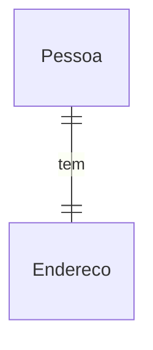

# Documento de Modelos

Neste documento temos o Modelo de Dados (Entidade-Relacionamento). Temos também a descrição das entidades e o dicionário de dados.

## Modelo Conceitual

### Modelo de Dados (Entidade-Relacionamento) usando Mermaid

### Descrição das Entidades

Descrição sucinta das entidades presentes no sistema.

| Entidade          | Descrição                                                                                                                                            |
| ----------------- | ---------------------------------------------------------------------------------------------------------------------------------------------------- |
| Pessoa           | Entidade abstrata para representar informações gerais das Pessoas: id, nome, idade.     |
| Endereço          | Entidade que representa um Endereço tem as informações: id, rua, numero, bairro, cidade, estado, cep, complemento.                                   |

### Dicionário de Dados

|   Tabela   | Pessoa                                                    |
| ---------- | ---------------------------------------------------------- |
| Descrição  | Armazena as informações de uma Pessoa.                     |
| Observação | --- |

|  Nome         | Descrição                          | Tipo de Dado | Tamanho | Restrições de Domínio |
| ------------- | ---------------------------------- | ------------ | ------- | --------------------- |
| id            | identificador gerado pelo ORM      | SERIAL       | ---     | PK / Identity         |
| idade     | idade do usuário      | DATE         | ---     | Not Null              |
| nome          | nome do usuário                    | VARCHAR      | 150     | Not Null              |

|   Tabela   | Endereco                                                    |
| ---------- | ----------------------------------------------------------- |
| Descrição  | Armazena as informações de endereço referente a um usuário. |
| Observação | ---                                                         |

|  Nome         | Descrição                          | Tipo de Dado | Tamanho | Restrições de Domínio |
| ------------- | ---------------------------------- | ------------ | ------- | --------------------- |
| id            | identificador gerado pelo ORM      | SERIAL       | ---     | PK / Identity         |
| rua           | rua do endereço do usuário         | VARCHAR      | 150     | Not Null              |
| numero        | numero do endereço do usuário      | VARCHAR      | 150     | Not Null              |
| bairro        | bairro do endereço do usuário      | VARCHAR      | 150     | Not Null              |
| cidade        | cidade do endereço do usuário      | VARCHAR      | 150     | Not Null              |
| estado        | estado do endereço do usuário      | VARCHAR      | 150     | Not Null              |
| cep           | cep do endereço do usuário         | VARCHAR      | 150     | Not Null              |
| complemento   | complemento do endereço do usuário | VARCHAR      | 150     | ---                   |

